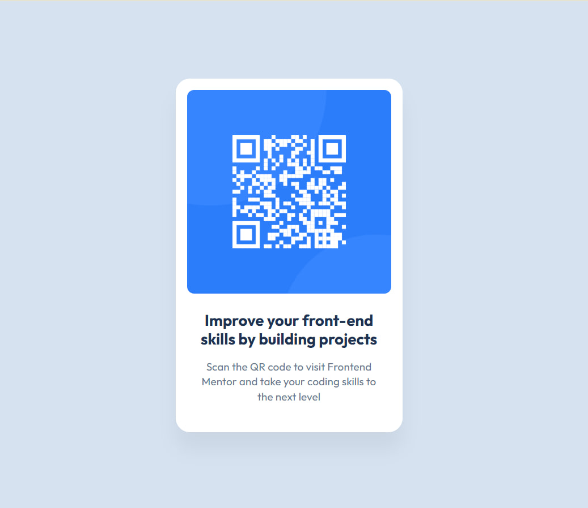

# Frontend Mentor - QR Code Component Solution

This is my solution for the [QR Code Component Challenge](https://www.frontendmentor.io/challenges/qr-code-component-iux_sIO_H) from Frontend Mentor.
A simple responsive QR code component built with HTML and CSS. 

## Table of Contents

- [Overview](#overview)
- [Screenshot](#screenshot)
- [Links](#links)
- [Built With](#built-with)
- [What I Learned](#what-i-learned)
- [Author](#author)

## Overview

This project displays a centered card with a QR code and a short description. It is perfect for beginners looking to practice basic layout techniques, Flexbox, and responsive design.

## Screenshot

## Links

- Solution URL: [https://github.com/OlenaYermak/qr-code-component-main](https://github.com/OlenaYermak/qr-code-component-main)
- Live Site URL: [https://olenayermak.github.io/qr-code-component-main](https://olenayermak.github.io/qr-code-component-main)

## Built With

- Semantic HTML5
- CSS custom properties
- Flexbox
- Responsive design principles

## Folder Structure

qr-code-component-main/
│
├── images/               # Contains the QR code image
├── design/               # Preview images from the challenge
├── index.html            # Main HTML file
├── style.css             # Main CSS file
└── README.md             # Project documentation

## What I Learned

While building this project, I improved my understanding of:

- Centering elements with Flexbox
- Setting fixed card dimensions for small components
- Applying box shadows and border radii for modern UI
- Creating fully responsive layouts

## Resources

- Frontend Mentor Challenge
- CSS Flexbox Guide
- Google Fonts

## Author

- GitHub – [OlenaYermak](https://github.com/OlenaYermak)
- Frontend Mentor – [@OlenaYermak](https://www.frontendmentor.io/profile/OlenaYermak)
